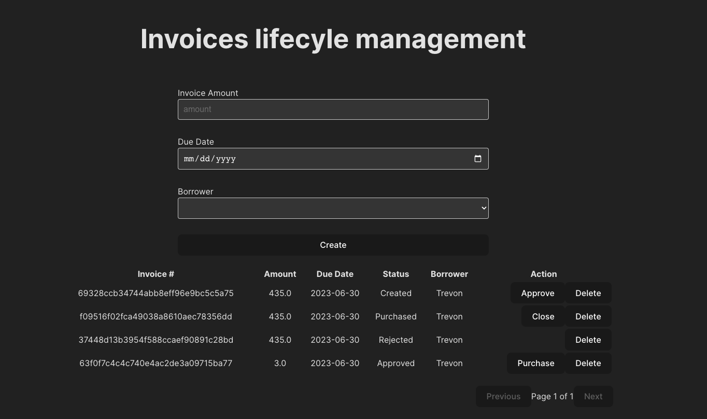

## Task for invoice lifecycle management(rails + react)

Server: rails 7, sqlite3
Client: React 18, Typescript, react-table

## Screenshot



# Frontend

The frontend folder contains a vite app with react and vitest pre configured.
Feel free to use any other framework or tooling you like.

Tested node version: 18.16.1

## Frontend Scripts

Runs the app in the development mode.

```
npm run dev
```

Runs the tests.

```
npm run test
```

# Backend

The backend folder contains a rails app with a few models already created.

Ruby version: 3.1.1

## Setup

To set up the backend server, you need to install `rbenv` and then install `ruby`, `gem`, and `bundler`. Once installed, you can follow the steps below:

1. Migrate the database:

```
rails db:migrate
```

2. Seed the database:

```
rails db:seed
```

This will populate the database with some initial data.

## Backend Scripts

Runs the app in the development mode.

```
rails server
```

This will start the backend server, and you can access the API endpoints at `http://localhost:3000`.

Runs the tests.

```
rails test
```

This will execute the test suite and display the test results.

Please make sure to have the required dependencies installed and follow the provided instructions to set up and run the frontend and backend components.
